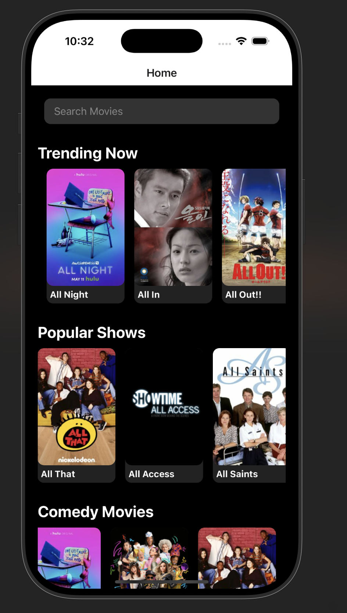

# Movie App 🎥 

A visually appealing movie app built with React Native. The app allows users to browse movies and search for them. It uses the [TVMaze API](https://api.tvmaze.com/search/shows?q=all) to fetch movie details. The app features a splash screen and navigation similar to Netflix.

---

## 📱 Features  
- **Splash Screen**: A visually captivating introduction screen.  
- **Home Screen**: Displays a list of movies fetched from the API.  
- **Search Screen**: Allows users to search for movies.  
- **Details Screen**: Shows movie details, including title, description, and more.  
- **Bottom Navigation**: Easily switch between the Home and Search screens.

---

## 🛠️ Technologies Used  
- **React Native**  
- **Expo**  
- **TVMaze API**  
- **JavaScript**  

---

## 🚀 Getting Started  

### Prerequisites  
- Node.js installed.  
- Expo CLI installed globally.  
- Code editor (e.g., Visual Studio Code).  

### Installation  
1. Clone the repository:  
   ```bash
   git clone https://github.com/<your-username>/<your-repository>.git
   ```  
2. Navigate to the project directory:  
   ```bash
   cd movie-app
   ```  
3. Install dependencies:  
   ```bash
   npm install
   ```  
4. Start the project:  
   ```bash
   npm start
   ```  

---

## 🖼️ Screenshots  

### Splash Screen  
  

### Home Screen  
  

### Search Screen  
  

### Details Screen  
  

---

## 📂 Project Structure  

```plaintext
movie-app/
├── assets/
├── components/
│   ├── MovieCard.js
│   ├── Navbar.js
├── screens/
│   ├── HomeScreen.js
│   ├── SearchScreen.js
│   ├── DetailsScreen.js
├── App.js
├── package.json
├── README.md
```

---

## 📚 API Reference  

This app fetches movie data from the [TVMaze API](https://api.tvmaze.com).  
Example API endpoint:  
```
https://api.tvmaze.com/search/shows?q=all
```

---

## 🤝 Contributing  

Contributions are welcome! Please follow these steps:  
1. Fork the project.  
2. Create a feature branch:  
   ```bash
   git checkout -b feature-name
   ```  
3. Commit your changes:  
   ```bash
   git commit -m "Add feature-name"
   ```  
4. Push to the branch:  
   ```bash
   git push origin feature-name
   ```  
5. Open a pull request.  

---

## 📜 License  

This project is licensed under the [MIT License](./LICENSE).  

---

## 💡 Acknowledgments  
- [TVMaze API](https://api.tvmaze.com)  
- Inspiration from the Netflix UI.  
